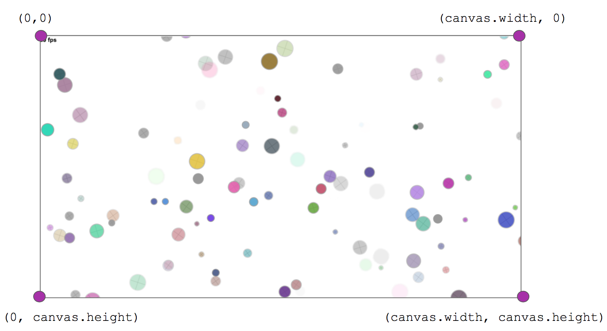

Circularity
===

A motion poem using random number generation and velocity applied to circles...

Also at: http://bit.ly/op-spark-circularity

**Table of Contents**

- [Circularity](#circularity)
  - [Installation](#installation)
  - [Overview](#overview)
    - [Specs](#specs)
    - [Take Away](#take-away)
    - [Entering Code](#entering-code)
    - [Type of App : Web](#type-of-app--web)
  - [Lesson Steps](#lesson-steps)
    - [Initializing Our App](#initializing-our-app)
      - [Loops To The Rescue](#loops-to-the-rescue)
    - [TODOs](#todos)
      - [TODO 1 : Declare Our Variables](#todo-1--declare-our-variables)
      - [TODO 2 : Create a function to draw a circle](#todo-2--create-a-function-to-draw-a-circle)
      - [TODO 3 : Draw 3 circles!](#todo-3--draw-3-circles!)
      - [TODO 4 : Move your circles](#todo-4--move-your-circles)
      - [TODO 5 : Keep your circles in the screen](#todo-5--keep-your-circles-in-the-screen)
      - [TODO 6 : Take a break!](#todo-6--take-a-break)
      - [TODO 7 : Draw 100 circles](#todo-7--draw-100-circles)
      - [TODO 8 : Iterate over the array](#todo-8--Iterate-over-the-array)
      - [TODO 9 : Move all our circles and keep them all in bounds](#todo-9--move-all-our-circles-and-keep-them-all-in-bounds)

## Installation
* Make sure your github and cloud9 accounts are linked to Greenlight
* Open your first website workspace
* go to your bash terminal (located at the bottom of the cloud9 workspace) and type in the command `os install`. Hit enter.

NOTE: If you receive an error that says, `os install command not found` the opspark CLI is not installed. To install it, enter the command `npm intall -g opspark` in your bash terminal. When the installation is complete try `os install` again.

* If prompted, login with your github credentials
* Use your arrow keys to highlight your course and hit enter. hit enter again to confirm.
* Use your arrow keys to highlight `circularity` and hit enter. hit enter again to confirm.
* open up the index.html file and press Run at the top of your workspace. You will be editing this file.

## (SKIP IF ALREADY INSTALLED) Installation without 'os install'

Create a new Cloud9 workspace and clone the project from github.com:

1. From your Cloud9 Dashboard, find in the upper left corner and click the green button, "Create New Workspace" > "Clone From URL":

    

2. In the "Source URL" form input, copy and paste in the following URL (see A):
    
        https://github.com/OperationSpark/circularity.git
    
    Then, in the environment selection box, select "HTML5" (see B).  Finally, click the green button "Create" (see C).
    
    

4. Now, when the workspace is loaded, select the command-line in the bottom window pane, and enter the command `bower install`, then press `Enter`, like this:

    

    You'll see some test flying by on the command-line as some required files are installed... and when complete, you'll see something like this:
    
    

Nice, you're in business...

***

## Overview

### Specs

The portrait of the programmer as a young artist continues, using random number generation, color, and velocity applied to circles in this little motion poem.  As usual, we're going to be drawing to an HTML5 Canvas element using the drawing API of the CreateJS module, EaselJS, and our helper library, draw, that simplifies the drawing process somewhat.

### Take Away

Using the draw line API to create a cool randomized piece of art.

Some concepts you'll learn are:


* Drawing with CreateJS and our draw utility.
* Leveraging the power of built-in and 3rd party API (DRY), like Math and opspark-draw.
* Variable declaration and initialization.
* Function invocation and passing arguments to functions.
* The for loop.
* Conditional statements - making decisions in code.
* Recognizing code blocks.
* Calculating coordinates in a cartesian system.
* Calculating boundaries.
* Animating.
* Pair programming.

### Entering Code

As we work through the app, you'll find `// TODO //` notes in our `app.js` file, and _under_ these `TODO` lines is where you'll enter the code we need to type.  It's important you enter the code you need to type for the step under these `TODO` place markers, because code is executed in a particular order.

So, to complete a lesson step, _find_ the `TODO` place marker in the appropriate JavaScript file:

**EXAMPLE**


...then put your cursor on the line below the `TODO`, and enter the code from the current lesson step:

**EXAMPLE**


Sweet!

### Type of App : Web

Note that **this app will run _in a web browser_**, preferably Chrome.

***

## Lesson Steps

To run the program open the file `index.html` and press "Run". All of our coding will happen in the `js/init.js` file.

***

### Initializing Our App

Starting up an application often takes a few steps of:

* Importing some libraries of code.
* Loading some external data.
* Declaring and initializing some variables for use in our app.

We've setup the app a little bit already, importing some libraries and initializing the basic plumbing in the background, and we won't be loading any external data in our app, so let's move on to declaring, initializing and using our variables.

Our motion poem will contain 100 randomly drawn circles, arranged randomly within the area of our canvas.  The big takeaway in this project is **DRY**: Don't repeat yourself!

We want to draw 100 circles, but we don't want to write the code to do so 100 times.  That would be a silly waste of time and effort, making the code very difficult to maintain.

#### Loops To The Rescue

Every programming language comes with features built-in to help you implement repetative processes, like looping over a list of data, or drawing a circle 100 times.  If we want to do anything more than once, we can use a _loop_, and is most often best practice to do so. 

Loops are a great tool to repeat a `{ code block }` a specific number of times and JavaScript comes with a number of built in loops, like `for`, `for-in`, and `while`. Additionally, many 3rd party libraries, like <a href="https://lodash.com/">_lodash_</a>, have implementations of other types of loops. We're going to use the `while` and `for` loops to accomplish our tasks for this project. 

To repeatedly execute some code using a loop, we answer 3 questions:

**1. What do we want to repeat?**
**2. What changes from loop to loop?**
**3. How long will the loop run?**

### While Loops
Let's start with a `while` loop. Suppose I wanted to print the messages `"pushups done: 1"`, `"pushups done: 2"`, and so on until a final message of `"pushups done: 10"`. To *hard-code* this, we could write:

```javascript
console.log("pushups done: 1");
console.log("pushups done: 2");
//... so on
console.log("pushups done: 10");
```

To do this using a loop we need answers to the 3 questions:

**Question 1. What do we want to repeat?** `console.log()` a message about how many pushups we've done.

**Question 2. What changes from loop to loop?** The number of pushups that we've done

**Question 3. How long will the loop run?** Until we've done 10 pushups

Using a `while` loop, we can accomplish this in only 4 lines of code, rather than 10

````javascript
// use a Variable to keep track of how many pushups have been done
var pushupsDone = 1;

// Keep repeating while (as long as) pushupsDone is less than or equal to 10
while(pushupsDone <= 10) {

	// use the Variable `pushupsDone` instead of a hard coded Number
	console.log("pushups done: " + pushupsDone);	

	// increase `pushupsDone` after each repetition
	pushupsDone = pushupsDone + 1;						
}
````

How would you modify this loop so that it does `100` pushups instead of just `10`?

### For Loops
Another kind of loop we will use is the `for` loop. The for loops takes the components of a while loop pattern used in the previous example and condenses it into one line. To create a for loop that runs 100 times we may write something like this:

````javascript
for(var pushupsDone = 1; pushupsDone <= 10; pushupsDone++) {
	console.log("pushups done: " + pushupsDone);	
}
````

After the keyword `for` are parentheses where you setup your for loop. Here is where you define how the loops starts, when it ends, and how you want to move on from one loop to the next. There are three parts to it:

* **initialization** : `var pushupsDone = 1;`
	* a variable `pushupsDone` is initialized to act as a counter to keep track of how many times we have run our loop. We start at 0.
* **stop condition** : `pushupsDone <= 10`
	* This statement is the condition against which we check on each loop. If `pushupsDone` is less than or equal to `10`, the code block for the loop will execute.
* **post condition** : `i++;`
	* This statement _increments_ (adds 1 to) the `pushupsDone` variable and is executed after each run of the loop.
	* NOTE: `pushupsDone++;` is shorthand for `pushupsDone = pushupsDone + 1;`, and you'll see the `++` or `--` operators used often in code to accomplish this type of pattern.

Finally, we have our code block within the braces `{ }` which contains the code that we want to repeat, along with the variable that will change from loop to loop.

### Iterating over an Array

For-loops also provide a convenient way to access elements of an Array one at a time. Arrays are *zero-indexed* lists of data. Basically, an Array acts as a container, into which we can throw objects, like strings, numbers, or circles. We call the things we throw into Arrays, _items_ or _elements_, as in, the _elements_ of our Array. Arrays are contained within square brackets `[ ]` and are stored in variables.

````javascript
var friends = ['John', 'Max', 'George', 'Ben', 'Steve', 'Brian'];
````

To retrieve an individual _element_ from an Array, we can use *Bracket Notation*, which uses the name of the Array, followed by square brackets that enclose a number representing the position of the element.

So, we can access the elements of the `friends` Array like so:

````javascript
var name = friends[1];
console.log(name); // prints Max
````

So, above, we used *Bracket Notation* to access the second element of the `friends` Array, `friends[1]`, which equates to `Max` and then log that value to the console. Because Arrays are zero-indexed, the first element is at index 0, the second element is at index 1, and so on.

When we want to access _every_ value within an array, this is called *iterating*. Iterating is the process of accessing each value of an Array using a for loop. This works by using the counter variable of a for loop (often named `i` - short for index) as a placeholder for the numbered index we want to access like so: 

````javascript
for (var i = 0; i < friends.length; i++) {
    var name = friends[i]. 
    console.log(name); // prints a different friend's name on each loop
}
````

As the value of `i` changes within the loop, so too will the value of `name` as it gets assigned to a new element within the Array `friends`. Notice that the stop condition of our loop has changed as well. We want to access every value of our array whose indexes range from `0` to `friends.length - 1`. Study the way that the for loop above has been set up to understand how we accomplish this.

***

### TODOs

#### TODO 1 : Declare Our Variables

Start by opening the `js/init.js` file. We will do all our coding in this file. Then, find TODO 1.

The goal of this project is to create 100 animated circles. Before we get ahead of ourselves, let's create one circle. Declare a variable to hold that circle (we will deal with initializing it later). Also we want to create an empty array to hold our circles, more on that later:

Find **TODO 1** and declare our variables like so:

````javascript
// other code...

// TODO 1: Declare our variables //
var circle;		// variable to hold a single circle when creating circles / iterating
var circles = [];	// variable to store all circles in one Array

// other code...
````

#### TODO 2 : Create a function to draw a circle

We will want to draw many circles in this project so putting the code to draw one circle inside a **function** will make the code much more re-usable! We've created a variable for you called `drawCircle` to hold our function. 

Under **TODO: 2** declare a Function `drawCircle`. It should have no Parameters. When called, it should execute the sequence below for creating and drawing a randomly sized `circle` and giving it a random velocity.

````javascript
// Code to draw a circle
circle = draw.randomCircleInArea(canvas, true, true, '#999', 2);
physikz.addRandomVelocity(circle, canvas);
view.addChild(circle);
circles.push(circle);

````

##### What does this code actually do?

First we call a function from the `draw` library: a collection of functions that allow us to draw various shapes on our `canvas`. This method, `draw.randomCircleInArea` will draw a circle of random size, color, and location within the screen along with a few other settings. Check out the parameters of the function below:

    randomCircleInArea(area, randomizeAlpha, addCross, borderColor, borderThickness, randomRadialProps)
    
We temporarily store the output of the function in `circle`. We then use the `physikz` library, a library of functions that provide motion to canvas drawings, to add a random velocity and direction to our circle.

To get the circle to appear on the screen we add the circle as a *child* of `view` (Think of the parent <-> child relationship of HTML elements!).

Lastly we save each new circle in an array using the `.push()` method. Doing so keeps all circles that we make together in one location which will be very useful very soon!

#### TODO 3 : Draw 5 circles!

Now, call your new Function: You can call the function using the following syntax:

```javascript
functionCallName();
```

##### Save your code, Refresh your game

You should now see 1 circle appear. Call the function 4 more times so that you have a total of 5 circles.

For now, by copying and pasting these function calls we are violating the **DRY Rule: D**ont **R**epeat **Y**ourself. Keep this in mind as we move on. We'll find a better way to do this!

#### TODO 4 : Move your circles

Awesome, let's do some fun stuff with our circles now.  Find the `function update()` where we will write code to animate our circles. 

Remember that our `update()` method is called 60 times per second (also referred to as 60 ticks per second). To get our circles to move we will use the `physikz.updatePosition( <objectToMove> )` method which accepts a circle as an argument. 

However, our circles are all stored in the `circles` **Array**. So, to retrieve an individual circle from our `circles` Array, we must use _Bracket Notation_:

	circles[ <index> ]

Below is an example of passing the first circle in the array to the function - how can you call this function on the 5 circles in our `circles` array?

````javascript
function update() {
    // TODO 4 : Update the circle's position //
    physikz.updatePosition(circles[0]);
    // code to call the function on the other 4 circles...
}
````

#### TODO 5 : Keep your circles in the screen 

##### Lesson Time! Cartesian Coordinates

Our next challenge is to keep the circles in our screen. To do so we must understand the Cartesian Coordinates of a computer screen. 

A computer screen is nothing more than a graph with an *x-axis* and a *y-axis* measured in units of *pixels*. A computer screen may be composed of millions of pixels so understanding this coordinate system is vital to accurately place animations on the screen. 

The *origin*, where the x-axis and y-axis intersect at 0, is always located in the top left corner of the browser window. As you move accross the screen from left to right, x values of pixels increase. As you move down the screen from top to bottom, the y values of pixels increases. 

##### TODO 5 Part 1) Call game.checkCirclePosition on each of your circles

We have created a function for you called `game.checkCirclePosition`. The function accepts a `circle` as an argument and uses a series of `if` statements to determine if the circle is within the bounds of the `canvas`. If a circle leaves the bounds of the screen it will appear on the opposite side of where it exited. 

For example, if a circle leaves the `canvas` along the _right_ border, we need to place the circle at the _left_ border. We have provided code to check this for you:

````javascript
if (circle.x > canvas.width) {
    circle.x = 0;
}

````

Within the `update` function call the `game.checkCirclePosition()` function, passing in each of the 5 circles to the function using bracket notation.

##### TODO 5 Part 2) Complete the function to keep your circles in the screen

You'll notice that the function is incomplete. It only checks the right border! To do this for each border, you'll have to make use of the following pieces of data:

    canvas.width    // The the width of our canvas.
    canvas.height   // The height of our canvas.
    circle.x        // The circle's position along the x-axis, good for testing the right and left side borders.
    circle.y        // The circle's position along the y-axis, good for testing the top and bottom borders.
    circle.radius   // Each circle is of a different size, so the radius will provide this information to you. 
    


The `canvas` represents the blank screen and allows us to add drawings to it. The canvas has 2 very important *properties* `.width` and `.height` that calculate the size of the window which may change depending on screen resolution or screen size.

Back in the `game.checkCirclePosition` function write a test for each border of the canvas that checks if the circle has fully exited the canvas by _that_ border. Using a chain of `if`, `else-if` statements, you'll need one test for each border, right-side, left-side, top, and bottom. If a circle leaves the canvas by one of its borders, you need to place the circle fully off the canvas at the opposite border.  Dig?

The best way to start this is to hack away, testing one border at a time!

CHALLENGE: The circle is centered around its own x and y position so we can find where its outer edges are located within the canvas by adding or subtracting its radius from its own x or y value. Use this information to make the circle's smoothly exit and enter the screen.

#### TODO 6 : Take a break!

Congrats! You have made a beautiful program that creates 5 circles, animates them, and keeps them within the screen. Take a 10 minute break from coding and reflect on the code that you have just written. Do you understand what each component does? 

When writing large programs it is a good practice to start small and work your way up to the full program. So far we have been able to create 5 circles, move them, and keep them in our screen's view. But what if we wanted our program to run with 100 circles? 

#### TODO 7 : Draw 100 circles

A loop should do the job! Here is the basic outline of a while loop and a for loop that each run 10 times:

````javascript
var counter = 0; 
while (counter < 10) {
    // do something
    counter++
}

for (var counter = 0; counter < 10; counter++) {
    // do something
}
````

Below **TODO 3** delete your calls to the `drawCircle` function and replace them with a loop that will loop **100** times and call the `drawCircle` function each time. Feel free to choose whichever loop you want!

#### TODO 8 : Iterate over the array

Now that we have 100 circles, we need a way to move all 100 circles and keep all 100 circles within the screen without calling on each circle individually. **Iterating** is the way to go!

Iteration is the process of accessing every element in an array and performing some action with that element. In our case, we want to access every `circle` from our `circles` array and apply the `physikz.updatePosition(circle)` function on each circle. Since this is a repetitive action, a loop is involved!

To iterate we can follow this pattern

```javascript

for (var i = 0; i < myArray.length; i++) {
    var eachValue = myArray[i];
    
    // code to repeat using eachValue
}
```
How can we apply this pattern to our `circles` array? What code do we want to execute for each value?

Within the `update` function, below **TODO 8**, follow the pattern above and create a loop that will iterate over the `circles` array and create a variable `var eachCircle` for each circle in the Array. 

#### TODO 9 : Move all our circles and keep them all in bounds

Awesome job! Now that we have our loop in place and we are iterating over our `circles` Array, let's use the `circle` that we pull out on each loop to do some cool stuff!

1. Within the loop that you just created, call the `physikz.updatePosition(eachCircle)` function.
2. Then, call the `game.checkCirclePosition(eachCircle)` function.
3. Delete your calls to those functions from **TODO 4** and **TODO 5**
4. Sit back and relax

Congrats!

&copy; Operation Spark 2015
